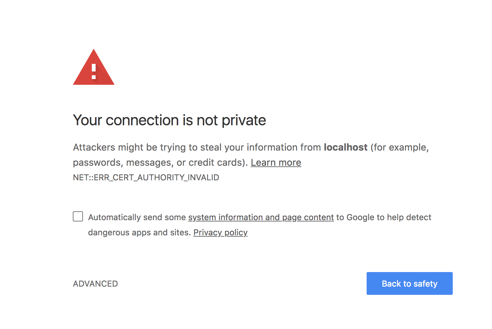

# Portal

This is a work in progress.

## Starting the Server

This application uses [Turing Census](https://github.com/turingschool-projects/omniauth-census) for authentication. Census requires ssl. A certificate has been created in the `.ssl` directory of this project to allow you to serve the project locally. In order to use this certificate run the following command:

```
rails s -b 'ssl://localhost:3000?key=.ssl/localhost.key&cert=.ssl/localhost.crt'
```

You will likely get a notification saying that your connection is not private. If you are using Chrome it might look something like this:



Click on `Advanced` and then on the link that says `Proceed to localhost (unsafe)`.

## Roadmap

### Complete

* Allow instructors to create projects
* Allow users to log in using Census
* Create rubric categories (through seeds file)
* Allow instructors to create rubrics
* Allow instructors
* Allow instructors to create assignments

### Next

* Create means to import a cohort of students from Census
* Allow instructors to create scores for student submissions (numeric and notes)
* Create means to import a list of cohorts from Census
* Allow instructors to import a cohort of students from Census

### Chores

* Clean up formatting so that `login` doesn't appear so close to the nav.
* Make display of `logout` button conditional on being logged in.
* Make welcome screen more welcoming.

## Notes

* First going to create tool to import a cohort from within `rails c` because I haven't yet figured out how to pull a list of cohorts from Census.
* 1808-BE Cohort id is 46

